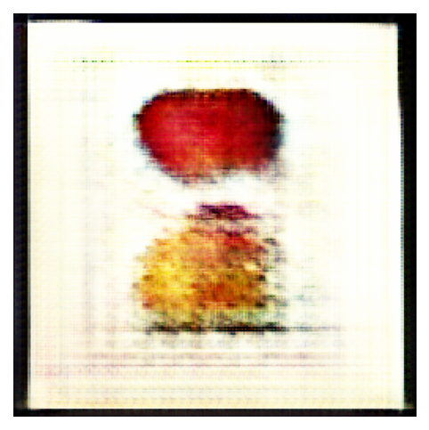

# Pomegan- GAN models for generating "USDA pomological watercolors"
In this repositiory you'll find two approaches to generating fake watercolor fruit based on the characteristics of the "USDA pomological watercolor collection" - this consists of 7580 watercolor images of a variety of different fruits, all painted around 1900. The collection, in a smaller, lower resolution format, is available on github in a repository of [jwilber](https://github.com/jwilber/USDA_Pomological_Watercolors). The images are available also in a higher resolution format [here](https://archive.org/download/usda-pomological-watercolor-collection).

## Model 1

The first approach is to use a classical DCGAN model, which I did using a variety of symmetric and asymmetric generator/discriminator pairs - I also implemented some of the loss function modifications from the literature, which can be experimented with. Examples of the results can be found in the output/from_scratch folder. 

## Models 2 and 3

The second approach was to use the Stylegan2 model developed by a team at NVidia labs, the paper associated to that can be found [here](https://arxiv.org/pdf/2006.06676.pdf) and the github repository I worked from can be found [here](https://github.com/NVlabs/stylegan2-ada-pytorch).

This gave considerably better output, but obviously has much longer training times, and is much more challenging to customise as the model has a more complex architecture. The results were correspondingly better however. The differences between these two are the following: the first is a literal usage of the NVlabs repository code with no changes, and with no labels and using the complete dataset, the second are for a version of the stylegan2 model that has its training parameters cut in two - which is at a (forked) repository [here](https://github.com/finnsl/stylegan2-ada-pytorch). 

The weights for all three models can be found at the following [link](https://drive.google.com/drive/folders/1GlZp5CPB89MAnKI9LDZUdFqiTV9nnAFh?usp=sharing) (they are considerable in size)

The latter was an experiment in how the performance changes with the changes to the latent dimension and the number of filters - I saw a training time improvement of 20% over the out-of-the-box version, but suffered a slight worsening of the FID score over the same training period (both trained for approximately 700k images, which is well below the thresholds the paper/repository on stylegan2 suggests would give satisfactory results, but were what was available using the machine from google colab pro, which had considerably less computing power than was available to the nvidialabs team).

Sample images for this can be found in output/stylegan2.

The current implementations of the models in all cases can be found in juypter notebooks in the main directory. 
